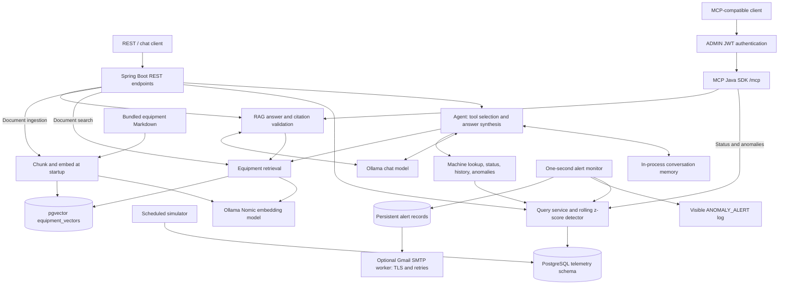

# IIoT Powered by AI

> **Authentication setup:** REST APIs now require JWT bearer tokens. Before starting,
> set `AUTH_JWT_SECRET` and the three `AUTH_INITIAL_ADMIN_*` values in `.env` (Docker)
> or your shell environment (host execution). Follow [Authentication](docs/authentication.md)
> for registration/login, token refresh, admin APIs and complete configuration.
> Obtain `ACCESS_TOKEN` using that guide before running the business API examples below.
> Health and Swagger remain public. RAG, chat, document search and MCP require ADMIN JWTs.


[](https://github.com/ParvezHossain/iiot-powered-by-ai/actions/workflows/ci.yml)

A local Industrial IoT demo that combines live simulated telemetry, equipment
manuals, a conversational agent, and authenticated MCP tools. Spring Boot runs
the simulator, rolling anomaly detector, REST APIs, agent, and alert workers;
PostgreSQL/pgvector stores measurements and document embeddings; Ollama runs the
embedding and chat models. No paid model API is required.

Equipment documents and machine data are synthetic. Answers expose their evidence;
statistical deviations are not diagnoses or permission to operate equipment.

## Architecture



The app is one deployable service. REST, agent tools, and MCP reuse the same query
and RAG services. Flyway owns the `telemetry` schema; Spring AI initializes the
separate vector table. Alert records also live in PostgreSQL’s `telemetry` schema.
Alerts run independently of user questions.

### Why RAG + tool calling + MCP?

| Component | Problem it solves | Example |
| --- | --- | --- |
| RAG | Retrieves relevant manual/log passages and attaches source quotes without putting the entire corpus in every prompt | “What does E204 mean?” |
| Tool calling | Fetches current or time-bounded facts from the database; the model chooses bounded Java functions instead of generating SQL | “What is SIM-001's latest vibration reading?” |
| RAG + tools | Combines measured data with applicable documented ranges/actions | “Is that vibration normal, and what should I do?” |
| MCP | Exposes those services through a standard tool protocol so an external client can discover and call them | `getMachineStatus`, `getRecentAnomalies`, `ragQuery` |

The chat model chooses data tools, retrieval, both, or neither. It resolves machine
names to stored UUIDs and synthesizes an answer from actual results. Agent evidence
labels are checked against successful calls; RAG quotes are checked against retrieved
passages. These checks establish provenance, not correctness of every interpretation.

Chat memory carries recent context when the caller reuses `conversationId`; fresh
facts still require fresh queries. Memory lasts up to six turns and 30 minutes idle,
and disappears on restart. MCP clients manage their own conversation context and
do not call through the chat agent.

## Run the full stack

Requirements: Docker Engine/Docker Desktop with the Compose v2 plugin, internet
access for the first image/build/model downloads, and a shell with `openssl` and
`curl`. Commands below use Bash on Linux/macOS or WSL. Java, Maven, and Node are
not needed for Docker startup. Allow several GB of disk for images and models;
CPU inference and the initial corpus embedding can take minutes. The timed demo
below is a separate, prepared-checkout workflow.

Clone the repository (requires Git), or extract a downloaded source archive, then
open a terminal in its root directory:

```sh
git clone https://github.com/ParvezHossain/iiot-powered-by-ai.git
cd iiot-powered-by-ai
```

Prepare the local configuration once:

```sh
cp .env.example .env
```

If `.env` already exists, edit it instead of overwriting it. It is ignored by Git.
The example selects both Compose files using `COMPOSE_FILE`; the AI override
enables RAG, chat, and MCP. Configure the JWT secret and initial ADMIN as described above. For native Windows
Compose, use `;` as the file separator or pass both files with `-f` explicitly.

Start everything with one command:

```sh
docker compose up --build -d --wait --wait-timeout 900
```

Compose starts PostgreSQL 17/pgvector and CPU Ollama. The one-shot `models` service
downloads missing `nomic-embed-text:v1.5` and `qwen2.5:1.5b` models into Ollama's persistent volume;
the app starts only after downloads succeed. It applies migrations, embeds the ten
bundled equipment documents, enables all three MCP tools, and starts simulation
and log alerts. `models` exiting with code 0 is expected. First-time downloads and
image builds can exceed 15 minutes on a slow connection; the wait timeout is not
a total download/build deadline. View progress with `docker compose logs -f models app`.

Check readiness and the indexed corpus:

```sh
docker compose ps -a
curl --fail http://localhost:8080/actuator/health/readiness
docker compose exec -T postgres psql -U iiot -d iiot -c \
  "SELECT COUNT(*) AS chunks, COUNT(DISTINCT metadata->>'document_id') AS documents FROM public.equipment_vectors;"
```

Expect `{"status":"UP"}`, 10 documents, and 34 chunks for the current corpus.
Readiness confirms startup checks/ingestion; it does not guarantee later model
availability or answer quality. Models are downloaded explicitly by the Compose
helper, never by a user question. Subsequent starts reuse downloaded model blobs
without contacting the model registry. To update an installed chat model explicitly,
run `docker compose exec ollama ollama pull qwen2.5:1.5b` (substitute your configured
model), then restart the app.

### Swagger API documentation

Open [Swagger UI](http://localhost:8080/swagger-ui/index.html) to explore and call
the enabled APIs. Download the specification as [JSON](http://localhost:8080/v3/api-docs)
or [YAML](http://localhost:8080/v3/api-docs.yaml). See the
[API documentation guide](docs/swagger-api.md) for endpoint coverage, feature flags,
MCP authentication, and configuration.

### Try the system

The default simulator creates `SIM-001` through `SIM-005`, with readings every
five seconds. Retrieve a real UUID and its latest status:

```sh
MACHINE_ID=$(docker compose exec -T postgres psql -U iiot -d iiot -Atc \
  "SELECT id FROM telemetry.machines WHERE name = 'SIM-001';")
curl -H "Authorization: Bearer $ACCESS_TOKEN" --fail "http://localhost:8080/api/machines/$MACHINE_ID/status"
curl -H "Authorization: Bearer $ACCESS_TOKEN" --fail http://localhost:8080/api/anomalies
```

An empty anomaly list can be expected during warm-up; it does not certify machine
health. The detector needs at least ten preceding samples, and the default
simulator injects a spike/dropout every twelve batches (roughly one minute).

Check retrieval and a grounded knowledge answer:

```sh
curl -H "Authorization: Bearer $ACCESS_TOKEN" --fail --get http://localhost:8080/api/documents/search \
  --data-urlencode 'query=What does E204 mean?' --data-urlencode 'topK=3'
curl -H "Authorization: Bearer $ACCESS_TOKEN" --fail http://localhost:8080/api/rag/query \
  -H 'Content-Type: application/json' -d '{"question":"What does E204 mean?"}'
```

E204 denotes an unavailable temperature sensor signal in the fictional compressor
reference. A supported answer includes checked source quotes; an unsupported or
invalid generated answer returns `insufficientEvidence=true`.

Ask a mixed question through the agent:

```sh
curl -H "Authorization: Bearer $ACCESS_TOKEN" --fail http://localhost:8080/api/agent/chat \
  -H 'Content-Type: application/json' \
  -d '{"question":"Is SIM-001 vibration normal, and what should I do if not?"}'
```

The response exposes `answer`, `evidence`, `evidenceIds`, `insufficientEvidence`,
and `conversationId`. To exercise three turns, copy the returned conversation ID
and send these two follow-ups with the same ID:

```sh
CONVERSATION_ID=replace-with-returned-uuid
curl -H "Authorization: Bearer $ACCESS_TOKEN" --fail http://localhost:8080/api/agent/chat -H 'Content-Type: application/json' \
  -d "{\"conversationId\":\"$CONVERSATION_ID\",\"question\":\"What is its latest vibration reading?\"}"
curl -H "Authorization: Bearer $ACCESS_TOKEN" --fail http://localhost:8080/api/agent/chat -H 'Content-Type: application/json' \
  -d "{\"conversationId\":\"$CONVERSATION_ID\",\"question\":\"And what about last week?\"}"
```

A new database has no last-week history; the correct response reports missing data.
“Last week” means the previous Monday–Sunday in UTC. Machine 12 is absent from the
default fleet; use SIM-001 or configure at least twelve simulated machines.

**Live-model limitation:** the small default chat model can skip required tools
or fail final citation validation. In fresh-stack verification, the mixed question
above returned `insufficientEvidence=true` with no tool evidence, while the REST
and MCP RAG queries returned a correctly cited E204 answer. A separate telemetry
chat successfully called machine lookup/status tools but failed final citation
validation. CPU chat can take
several minutes. A healthy stack therefore does not guarantee a successful mixed
answer. The deterministic demo verifies routing
and memory with fixtures; it is not evidence that all live model answers pass.
`AGENT_MODEL` and `RAG_ANSWER_MODEL` in `.env` select other Ollama chat models;
the bootstrap downloads both if they differ. Re-evaluate routing and citations
after changing models. Keep the embedding model fixed to preserve vector compatibility.

### Connect MCP

Configure a client for **Streamable HTTP**, URL `http://localhost:8080/mcp`, and
header `Authorization: Bearer <ADMIN access token from /api/auth/login>`. Expect
`getMachineStatus`, `getRecentAnomalies`, and `ragQuery`. This is not a stdio or
legacy SSE server. ADMIN JWTs grant all three read-only tools for all machines.

Without credentials, this must return HTTP 401:

```sh
curl -i http://localhost:8080/mcp
```

For client discovery/calls without an LLM, the optional
[MCP Inspector](https://github.com/modelcontextprotocol/inspector) requires
Node/npm. Log in as ADMIN to obtain `ACCESS_TOKEN`, then list tools:

```sh
npx @modelcontextprotocol/inspector --cli http://localhost:8080/mcp --transport http \
  --header "Authorization: Bearer $ACCESS_TOKEN" --method tools/list
```

RAG, chat, documents and MCP require ADMIN JWTs. USERs retain telemetry access.
Compose binds all published ports to localhost. This is a local demo deployment,
not a public multi-tenant service.

### See alerts and optionally enable Gmail

```sh
docker compose logs -f app
```

Look for `ANOMALY_ALERT` shortly after an injected fault. Log alerts need no email
account. To send email through Gmail, put these settings in your ignored `.env`:

```dotenv
ALERTS_GMAIL_ENABLED=true
GMAIL_USERNAME=your-account@gmail.com
GMAIL_APP_PASSWORD=your-google-app-password
ALERT_EMAIL_TO=your-recipient@example.com
```

Use a Google app password with 2-Step Verification, not your normal account
password. Some account/organization policies do not permit app passwords; see
[Google's setup instructions](https://support.google.com/accounts/answer/185833?hl=en).
Run `docker compose up -d --wait --wait-timeout 900 app` to apply settings. The worker
uses `smtp.gmail.com:587` with required STARTTLS and retries failed sends every
30 seconds, up to five attempts. `ANOMALY_EMAIL_SENT` means SMTP accepted the
message, not confirmed inbox delivery. Use one alert-worker instance per database.

## Configuration and operations

Edit `.env` and use the same Compose configuration for subsequent commands.
Exported shell variables take precedence over `.env` values.

| Setting | Default / behavior |
| --- | --- |
| `APP_PORT`, `POSTGRES_PORT`, `OLLAMA_PORT` | `8080`, `5432`, `11434`; change these for occupied ports and adjust curl/client URLs |
| `POSTGRES_PASSWORD` | `iiot_dev`, local demo credential; database and user are `iiot` |
| `SIMULATOR_ENABLED`, `SIMULATOR_MACHINE_COUNT` | `true`, `5` (range 1–1000) |
| `SIMULATOR_INTERVAL_MS`, `SIMULATOR_ANOMALY_EVERY_TICKS`, `SIMULATOR_SEED` | `5000`, `12`, `42`; minimum interval 100 ms |
| `RAG_INGEST_ON_STARTUP`, `RAG_BATCH_SIZE` | `true`, `16`; refresh bundled documents at startup |
| `ALERTS_ENABLED`, `ALERTS_GMAIL_ENABLED` | `true`, `false` |

The AI override forces `RAG_ENABLED`, `AGENT_ENABLED`, and `MCP_ENABLED` on.
For a telemetry-only run without model downloads, explicitly select the base file:

```sh
docker compose -f docker-compose.yml up --build -d --wait
```

Use the base `-f` on subsequent commands for that mode. Without a local `.env`,
plain `docker compose up --build` also selects this lightweight mode. The full-stack
instructions above intentionally opt in to models; AI and MCP calls require ADMIN JWTs.

PostgreSQL data, alert delivery state, and model blobs persist in named volumes.
Changing `POSTGRES_PASSWORD` does not change a password already stored in an existing
database. Bundled documents are packaged in the app image; rebuild after editing
them. Startup ingestion replaces the equipment corpus transactionally.

```sh
docker compose stop                  # Stop containers, retain everything.
docker compose up -d --wait --wait-timeout 900  # Resume.
docker compose down                  # Remove containers/network, keep volumes.
```

Only use `docker compose down --volumes` when you deliberately want to erase
telemetry, alerts, document vectors, and downloaded models.

| Symptom | Check / fix |
| --- | --- |
| Docker Hub returns 401 while loading `eclipse-temurin` metadata | Retry the base-image pulls and rebuild using the steps below |
| Port already allocated | Change the relevant port in `.env`; preserve it for every invocation |
| MCP returns 401 / 403 | Log in for a fresh ADMIN access token; USER accounts cannot call MCP |
| `models` exits nonzero | `docker compose logs models ollama`; check network, disk, and model names, then rerun `up` |
| App never becomes healthy | `docker compose logs app`; inspect database connectivity, model availability, and ingestion failure |
| `vector` extension missing in an older database | Run `docker compose exec postgres psql -U iiot -d iiot -c 'CREATE EXTENSION IF NOT EXISTS vector;'`, then restart the app |
| Chat/RAG returns 503 or MCP returns 404 | Enable the corresponding feature flags; use the AI override with PostgreSQL/pgvector and Ollama |
| HTTP 503 on knowledge/chat | Inspect app/Ollama logs; confirm both models with `docker compose exec ollama ollama list` |
| HTTP 200 with insufficient evidence | Inspect returned evidence and retrieval matches; see the live-model limitation above |
| Timed demo fails offline | Run the one-time Maven preparation below before rehearsing |

### Docker Hub 401 during image build

A failure while loading metadata for `eclipse-temurin:21-jdk` or
`eclipse-temurin:21-jre` occurs before Java compilation and application startup.
First retry the public base-image pulls, then rebuild and start the stack:

```sh
docker pull eclipse-temurin:21-jdk
docker pull eclipse-temurin:21-jre
docker compose build app
docker compose up -d --wait --wait-timeout 900
```

Transient registry/network failures can clear on retry. If either pull still
returns 401, run `docker login` and retry using the same user and Docker context.
If login succeeds but pulls still fail, check VPN/proxy access and Docker daemon
network configuration. Application `AUTH_*` settings do not control image pulls.

An unauthenticated registry request can normally return a 401 bearer challenge;
Docker must complete the token exchange before fetching the image manifest.
See [Docker registry authentication](https://docs.docker.com/reference/api/registry/auth/),
[Docker login](https://docs.docker.com/reference/cli/docker/login/), and the
[detailed troubleshooting guide](run.md#docker-hub-401-while-loading-java-base-image-metadata).

## Local development, tests, and interview demo

For an H2 telemetry-only development server, install JDK 21+ and run
`./mvnw spring-boot:run` (`mvnw.cmd` on Windows). No PostgreSQL or Ollama is needed;
H2 data and chat memory disappear on shutdown. The first build downloads Maven
and dependencies. `./mvnw verify` runs the automated suite without a live model;
CI additionally checks PostgreSQL/pgvector persistence and runs the demo script.

For the under-two-minute interview replay, use Linux/macOS/WSL, Python 3, and JDK
21+. Prepare once, then run the single command:

```sh
./mvnw --batch-mode --no-transfer-progress -Dtest=InterviewDemoTests test
python3 scripts/demo.py
```

The second command runs offline, starts isolated temporary services, verifies data,
knowledge, mixed questions, three-turn memory, authenticated MCP, and automatic
alerts, then prints a transcript. It uses **scripted model/retrieval fixtures** with
real application services and never sends Gmail. Three consecutive rehearsals took
26.7, 20.9, and 20.8 seconds; first-time preparation and live model calls are
outside the time bound.

## Further detail

| Topic | Reference |
| --- | --- |
| Schema, measurements, and events | [Schema and ERD](docs/telemetry-schema.md), [telemetry API](docs/telemetry-api.md) |
| Rolling detector, precision/recall | [Anomaly detection](docs/anomaly-detection.md) |
| Synthetic manuals and maintenance logs | [Corpus](docs/equipment-corpus.md) |
| Chunking, embeddings, source validation | [Ingestion](docs/rag-ingestion.md), [grounded answers](docs/rag-query.md) |
| Tool routing, bounds, memory, live checks | [Agent](docs/agent-chat.md) |
| MCP protocol, tools, auth scope | [MCP server](docs/mcp-server.md) |
| Gmail setup, retries, delivery limitations | [Alerting](docs/alerting.md) |
| Demo fixtures and walkthrough | [Interview demo](docs/interview-demo.md) |
| Fresh-start verification and live-model results | [T6.1 verification](docs/t6.1-verification.md) |

[MIT license](LICENSE).
