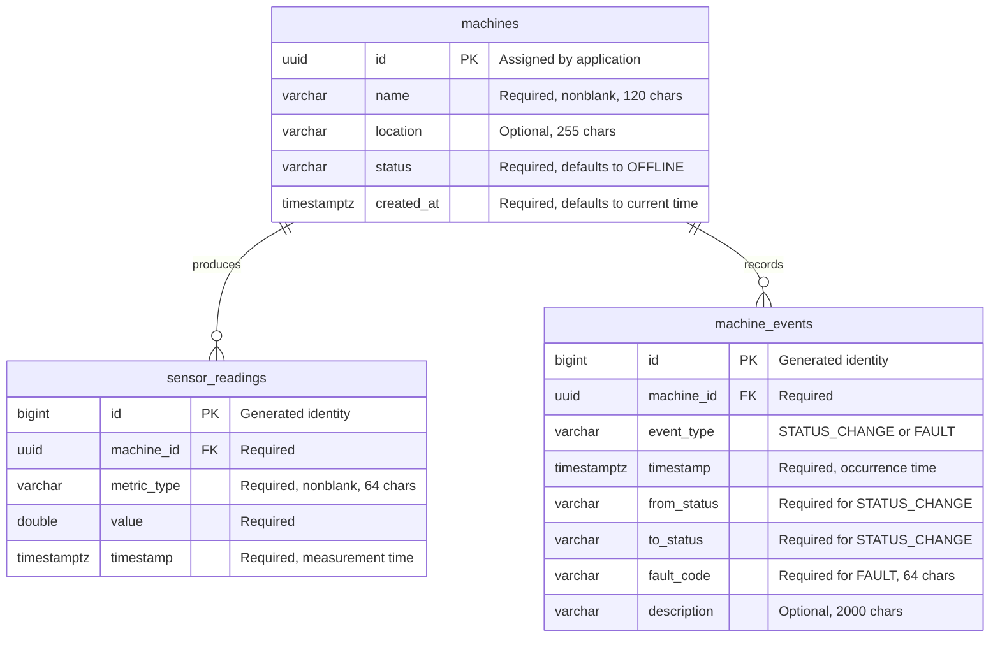

# Telemetry schema

Flyway migration: [`V1__create_telemetry_schema.sql`](../src/main/resources/db/migration/V1__create_telemetry_schema.sql).
The same migration runs on PostgreSQL 17 and embedded H2 at application startup,
before JPA initializes. Flyway owns the `telemetry` schema and records versions in
`telemetry.flyway_schema_history`. Hibernate DDL generation is disabled.
The existing `public.vector` extension stays in `public`; no automatic baseline
of an existing schema is required.

## Entity relationship diagram



## Data rules

- Machine IDs are UUIDs assigned by the application/simulator. Names are display
  labels and need not be unique. A machine may have no readings or events yet.
- Allowed statuses are `RUNNING`, `IDLE`, `STOPPED`, `MAINTENANCE`, `FAULTED`, and
  `OFFLINE`. `machines.status` holds the current state.
- A status-change event requires distinct, valid `from_status` and `to_status`
  values and no fault code. A fault event requires a nonblank `fault_code` and
  no status fields. If a fault also changes status, write two events.
- Recording a status event does not automatically update the machine row.
  Future ingestion code must update current status and insert its event in the
  same transaction. No status-transition graph is imposed in this initial schema.
- Readings use `DOUBLE PRECISION` for approximate sensor measurements. Metric
  identifiers are extensible strings; encode the canonical unit in the identifier,
  for example `temperature_celsius`, `pressure_bar`, or `vibration_mm_s`.
  Producers must validate finite values and metric-specific ranges.
- All timestamps are `TIMESTAMP(6) WITH TIME ZONE` (PostgreSQL `timestamptz`),
  representing instants with microsecond precision. Supply an explicit offset
  and use UTC in application APIs. Measurement/event times are required from
  the producer, rather than defaulting to ingestion time.
- Multiple readings of the same metric at the same instant are allowed, as are
  late/out-of-order observations. IDs distinguish rows; ingestion deduplication
  and retention policies are future work.
- Foreign keys reject orphan readings/events and prevent deleting a machine
  that has history. There is no cascading deletion.
- SQL quotes `"value"` and `"timestamp"` for compatibility with H2 keywords.
  Application SQL should schema-qualify tables and quote these column names.

## Query indexes

| Index | Supports |
| --- | --- |
| `ix_sensor_readings_machine_metric_time` | Metric history/latest reading for one machine |
| `ix_sensor_readings_machine_time` | All metrics for one machine over a time range |
| `ix_machine_events_machine_time` | A machine's event timeline |

Each index starts with `machine_id` and ends with descending `timestamp`.
Primary keys also have indexes. These are ordinary time-series tables; native
partitioning, TimescaleDB, and retention jobs are deferred until volume and
retention requirements are defined.

Example query (half-open UTC interval):

```sql
SELECT metric_type, "value", "timestamp"
FROM telemetry.sensor_readings
WHERE machine_id = '00000000-0000-0000-0000-000000000001'
  AND metric_type = 'temperature_celsius'
  AND "timestamp" >= TIMESTAMP WITH TIME ZONE '2026-09-07 00:00:00+00'
  AND "timestamp" < TIMESTAMP WITH TIME ZONE '2026-09-08 00:00:00+00'
ORDER BY "timestamp" DESC;
```

## Apply and verify

```sh
docker compose up -d --build --wait
docker compose logs app
docker compose exec postgres psql -U iiot -d iiot -c 'SELECT version, description, success FROM telemetry.flyway_schema_history;'
docker compose exec postgres psql -U iiot -d iiot -c '\dt telemetry.*'
```

If host ports are occupied, use `APP_PORT=8081 POSTGRES_PORT=5433` before the
Compose command. V1 adds only new tables in `telemetry`, so existing pgvector
installations and data volumes can be retained. Subsequent startups validate
checksums and apply only pending migrations. Add a new numbered migration for
future changes; do not edit V1 after deployment.

`./mvnw verify` exercises startup migration, timestamp round-tripping, valid
records, and relational/event constraints on H2. CI repeats `TelemetrySchemaTests`
against a PostgreSQL 17 service. Test rows roll back after each test.
